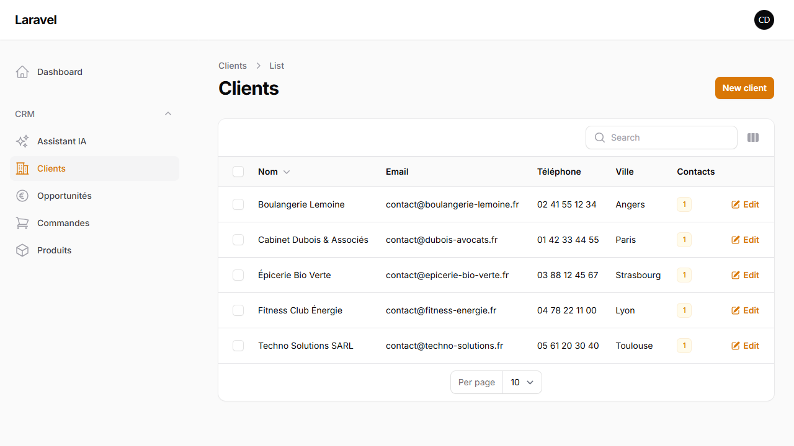
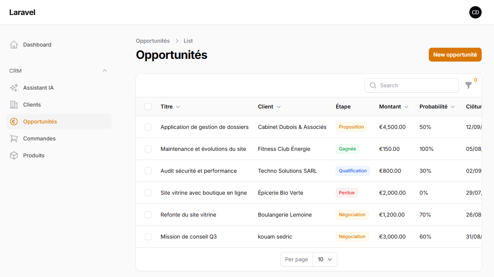
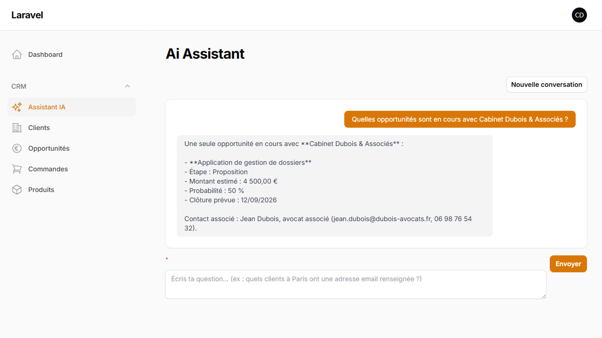

# CRM/ERP interne avec assistant IA (RAG)

Application de gestion interne (clients, contacts, opportunités, commandes) construite sur la stack **TALL** (Laravel, Filament), avec un assistant conversationnel capable de répondre en langage naturel à des questions sur les données du CRM, via une architecture RAG (Retrieval-Augmented Generation).

**Projet de démonstration** — pensé pour illustrer une intégration IA de bout en bout dans une application métier réelle : modélisation des données, pipeline RAG (embeddings + recherche par similarité + génération), et les arbitrages techniques que ça implique en conditions réelles (rate limits, coûts API, robustesse réseau). Pas de démo en ligne pour l'instant — voir la section [Installation](#installation) pour lancer le projet en local.

## Aperçu

| Liste des clients | Pipeline commercial |
|---|---|
|  |  |

**Assistant IA en action** — question posée en langage naturel, réponse générée à partir des données réelles du CRM (client, opportunité, contact associé) :



## Fonctionnalités

- **Gestion CRM** : clients, contacts, avec fiches détaillées et recherche
- **Pipeline commercial** : opportunités avec étape, montant estimé, probabilité, date de clôture
- **Volet ERP léger** : catalogue produits, commandes avec lignes et calcul automatique du total, référence auto-générée
- **Assistant IA conversationnel** : pose des questions en langage naturel sur les clients/opportunités/commandes ; garde le contexte sur plusieurs échanges (ex. « Quel est son site web ? » après avoir parlé d'un client, sans répéter son nom)

## Ce que ce projet démontre

- **Intégration IA en conditions réelles**, pas un simple wrapper d'API : pipeline RAG complet (embeddings → recherche par similarité → génération augmentée), gestion du contexte conversationnel, prompt système contraint pour éviter les hallucinations sur des données métier.
- **Modélisation d'un domaine métier complet** : CRM (clients, contacts, pipeline commercial) + volet ERP léger (catalogue, commandes, lignes, totaux calculés), avec les relations et règles associées.
- **Rigueur sur les points qui cassent en production** : rate limiting utilisateur sur l'assistant IA, gestion d'erreurs sans fuite d'information technique, `.env` jamais exposé, jobs asynchrones pour ne pas bloquer les requêtes HTTP sur des appels API externes.
- **Honnêteté technique** : les limites connues et les arbitrages (voir ci-dessous) sont documentés plutôt que cachés — utile pour juger la capacité à livrer un projet maintenable, pas juste une démo qui marche une fois.

## Stack technique

| Composant | Choix |
|---|---|
| Framework | Laravel 12 |
| Interface admin | Filament 3 |
| Base de données | PostgreSQL |
| Génération d'embeddings | [Voyage AI](https://www.voyageai.com/) |
| Génération de réponses | [Claude](https://www.anthropic.com/) (Anthropic PHP SDK) |
| File d'attente | Laravel Queue (driver `database`) |

## Architecture — comment fonctionne l'assistant IA

1. Chaque client, contact, opportunité et commande a une représentation textuelle (`toEmbeddingText()`) générée automatiquement à sa création/modification.
2. Ce texte est envoyé à Voyage AI pour obtenir un vecteur d'embedding, stocké dans la table `embeddings` (relation polymorphique, réutilisable pour n'importe quel modèle).
3. Quand l'utilisateur pose une question, celle-ci (combinée aux derniers échanges de la conversation, pour la résolution de contexte) est elle-même vectorisée, puis comparée à tous les embeddings stockés par **similarité cosinus**.
4. Les enregistrements les plus pertinents sont injectés comme contexte dans un appel à l'API Claude, qui génère la réponse finale.

### Choix d'architecture notables

- **Pas de pgvector.** L'extension PostgreSQL `pgvector` n'a pas d'installeur Windows simple (compilation manuelle via Visual Studio Build Tools requise). Pour un CRM de cette taille (centaines/milliers d'enregistrements), le calcul de similarité cosinus est fait directement en PHP (`Embedding::cosineSimilarity()`), ce qui évite toute dépendance système supplémentaire. Migrable vers pgvector si le volume de données le justifie un jour.
- **Génération d'embeddings asynchrone.** Chaque sauvegarde d'un enregistrement "embeddable" (`App\Contracts\Embeddable`) déclenche un job en file d'attente (`GenerateEmbeddingJob`) plutôt qu'un appel API bloquant la requête HTTP.
- **`saveQuietly()` sur le recalcul du total des commandes.** Le total d'une commande est une donnée dérivée des lignes de commande ; le recalculer ne doit pas redéclencher un job d'embedding à chaque ligne ajoutée (bug rencontré et corrigé en cours de développement : une commande de plusieurs lignes déclenchait autant d'appels API redondants, jusqu'à dépasser la limite de débit de l'offre gratuite Voyage AI).

### Limite connue

La recherche RAG récupère les enregistrements les plus *similaires* à la question (top-K), pas une agrégation exacte. Une question comme « combien de clients avons-nous au total ? » ou une comparaison portant sur un grand nombre d'enregistrements peut donner une réponse incomplète ou imprécise — c'est une limite structurelle de cette approche, pas un bug. Une évolution possible serait d'ajouter un mode "requête structurée" (texte-vers-SQL) en complément pour ce type de question.

## Installation

### Prérequis

- PHP 8.4+
- Composer
- PostgreSQL
- Une clé API [Anthropic](https://console.anthropic.com/) (`ANTHROPIC_API_KEY`)
- Une clé API [Voyage AI](https://dashboard.voyageai.com/) (`VOYAGE_API_KEY`)

### Étapes

```bash
composer install
cp .env.example .env
php artisan key:generate
```

Configurer dans `.env` :

```
DB_CONNECTION=pgsql
DB_HOST=127.0.0.1
DB_PORT=5432
DB_DATABASE=ai_app
DB_USERNAME=postgres
DB_PASSWORD=

ANTHROPIC_API_KEY=
VOYAGE_API_KEY=
```

Puis :

```bash
php artisan migrate
php artisan make:filament-user   # créer un compte administrateur
php artisan db:seed --class=DemoSeeder   # optionnel — données de démo (clients, opportunités, commandes)
```

Pour lancer le serveur **et** le worker de file d'attente (indispensable pour la génération des embeddings) en une seule commande :

```bash
composer run dev
```

Ça démarre en parallèle `php artisan serve`, `php artisan queue:listen` et les logs (`php artisan pail`). Sans cette commande, `php artisan serve` bloque le terminal — il faut alors ouvrir un second terminal pour `php artisan queue:work`.

Pour générer les embeddings des enregistrements déjà existants :

```bash
php artisan embeddings:generate --sync
```

L'application est accessible sur `http://localhost:8000/admin`, l'assistant IA sur `/admin/ai-assistant`.

## À propos du développement de ce projet

Ce projet a été développé avec l'assistance de [Claude Code](https://claude.com/claude-code). Les décisions d'architecture (choix de la stack, arbitrage pgvector vs. calcul PHP, structure des entités CRM/ERP, conception du pipeline RAG) ont été prises et validées au fil de la conversation ; l'implémentation a été largement assistée par IA. Cette transparence est volontaire : le code reflète un usage réel et assumé des outils de développement assisté par IA, courant en 2026.
